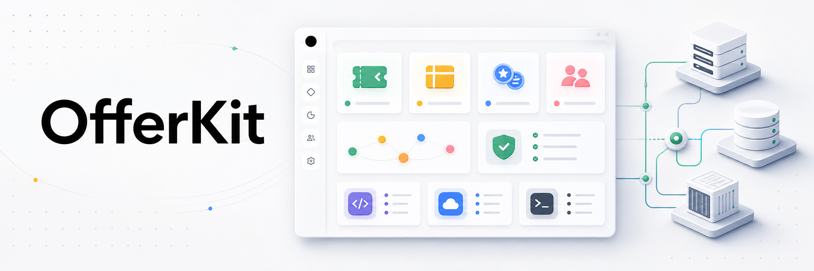

<p align="center">
  
</p>

<h1 align="center">OfferKit</h1>

<p align="center">
  <strong>Agent-first, dev-friendly, open-source promotion engine you self-host.</strong>
</p>

<p align="center">
  <a href="#-why-offerkit">Why OfferKit</a> ·
  <a href="#-quick-start">Quick Start</a> ·
  <a href="#-self-host">Self-Host</a> ·
  <a href="#-sdk--cli--mcp">SDK &amp; CLI</a> ·
  <a href="#-docs">Docs</a> ·
  <a href="#-license">License</a>
</p>

OfferKit is a complete promotion engine — coupons, gift cards, loyalty, referrals, customer segments, validation rules — surfaced as a dashboard, a typed REST API, a TypeScript SDK, a CLI, and a curated MCP server. One published Docker image runs both web and worker, so you can self-host without building this monorepo in production. Strict TypeScript, MIT throughout, agentic from day one.

## 🤖 Why OfferKit

**Agent-first.** The MCP server is a first-class surface, not bolted on. Every mutating endpoint declares its risk level (`safe` / `mutating` / `destructive`) so LLM hosts can render the right confirmation. New procedures opt into MCP exposure declaratively via `.meta()` — no separate package to update.

**Dev-friendly.** The typed SDK is derived directly from the oRPC contract, so client types stay in lockstep with the server with zero codegen. Strict TypeScript, no `any`, no `as` casts. The `/docs` site lives inside the app (Fumadocs). Local-first dev — Docker compose, no CI, lefthook is the only quality gate.

**Open source.** MIT throughout the monorepo. No CLA at v1.0. No commercial features paywalled. Built entirely on top of MIT/Apache OSS.

**Self-hostable.** One `docker compose up` brings up web + worker + Postgres + Redis from `ghcr.io/offerkit/offerkit`. Railway uses the same published image for both services; no GitHub source deploy required. OpenTelemetry-ready out of the box for any OTLP backend.

## ✨ Features

- 🎟️ Discount engine — fixed-amount, percentage, with optional caps, scoped to products or collections
- 🧾 Stackable redemptions — apply N codes to one order atomically, all-or-nothing
- 💳 Gift cards — full ledger, partial spend, atomic rollback
- 🏆 Loyalty — programs, tiers, earning rules, points ledger, expiration
- 👥 Referrals — `{PREFIX}-{code}` codes, dual-reward conversions
- 🧩 Customer segments — JSON Logic rules with live preview
- ✅ Validation rules — debuggable, traceable; tested on every redemption
- ⚙️ Background jobs — Postgres-backed queue, no Redis required
- 🔭 Observability — OpenTelemetry traces, metrics, logs out of the box
- 🔐 Audit log — every mutation with actor, before/after, IP, user agent
- 🤖 MCP server — declaratively-exposed tools with risk-level metadata
- 📜 MIT — every package, every dependency

## 🚀 Quick Start

Requires Docker.

```bash
git clone https://github.com/offerkit/offerkit.git
cd offerkit
cp .env.example .env
docker compose up
```

Visit <http://localhost:3000> and sign in with the `ADMIN_EMAIL` / `ADMIN_PASSWORD` you set in `.env`. The first sign-in forces a password change.

## 🏠 Self-Host

### Docker compose

The `docker-compose.yml` brings up `web` + `worker` + `postgres` + `redis`. Both runtime services use the same published image, `ghcr.io/offerkit/offerkit`. Migrations run automatically on web boot. Background jobs are queued in Redis via BullMQ. See [`/docs/self-host`](apps/web/content/docs/self-host.mdx) for env vars and tuning.

### Railway

[](https://railway.com/new)

In one Railway project, create Postgres and Redis, then create two Docker Image services from `ghcr.io/offerkit/offerkit:latest`. The public `web` service uses the default command. The private `worker` service overrides the command to `node apps/worker/dist/index.js` and should not have a public domain. Reference Postgres's `DATABASE_URL` and Redis's `REDIS_URL` into both app services. Set `BETTER_AUTH_SECRET`, `OFFERKIT_PUBLIC_URL`, `ADMIN_EMAIL`, and `ADMIN_PASSWORD` on the `web` service.

### Diploi

[](https://diploi.com/launch/akshitkrnagpal/offerkit)

Create one Diploi project with a public `web` component, a private `worker` component, Postgres, and Redis. Use the same published image, `ghcr.io/offerkit/offerkit:latest`, for both components. The worker command is `node apps/worker/dist/index.js`. Wire Postgres's `DATABASE_URL` and Redis's `REDIS_URL` into both components. Set `BETTER_AUTH_SECRET`, `OFFERKIT_PUBLIC_URL`, `ADMIN_EMAIL`, and `ADMIN_PASSWORD` on `web`; set `WORKER_HEALTH_PORT=9091` on `worker`.

## 📦 SDK & CLI & MCP

### TypeScript SDK

```bash
pnpm add @offerkit/sdk
```

```ts
import { createClient } from "@offerkit/sdk";

const client = createClient({
  baseUrl: "https://your-offerkit-deployment",
  apiKey: process.env.OFFERKIT_API_KEY!,
});

const result = await client.vouchers.redeem({
  code: "SUMMER10",
  order: { amount: 9999, currency: "USD" },
});
```

### CLI

```bash
pnpm add -g @offerkit/cli
offerkit login --url https://your-offerkit-deployment --api-key offerkit_…
offerkit vouchers list
offerkit vouchers redeem SUMMER10 --amount 9999
```

### MCP server

```jsonc
{
  "mcpServers": {
    "offerkit": {
      "command": "npx",
      "args": ["-y", "@offerkit/mcp"],
      "env": {
        "OFFERKIT_API_URL": "https://your-offerkit-deployment",
        "OFFERKIT_API_KEY": "offerkit_…"
      }
    }
  }
}
```

## 🛠️ Built With

- **Next.js 16** (App Router, React 19) — dashboard + REST API
- **Postgres 17** + **Drizzle ORM** — schema, migrations, typed client
- **Better Auth** — sessions for the dashboard, API keys for programmatic access
- **oRPC** + **Zod** — single contract for RPC, REST, and OpenAPI
- **Tailwind v4** + **shadcn/ui** — dashboard UI
- **gt-next** — i18n runtime
- **Fumadocs** — `/docs` embedded in the app
- **OpenTelemetry** — traces, metrics, logs
- **TypeScript** strict, **MIT** throughout

## 🏗️ Development

Requires Node 24+, pnpm 10+, running Postgres, and Redis.

```bash
pnpm install
cp .env.example .env             # edit DATABASE_URL etc.
pnpm --filter @offerkit/db push
pnpm --filter @offerkit/web dev          # web on :3000
pnpm --filter @offerkit/worker dev       # worker on :9091
```

To test the production image shape from local source:

```bash
docker compose -f docker-compose.yml -f docker-compose.dev.yml up --build
```

```
apps/web         Next.js dashboard + REST API + /docs (Fumadocs embedded)
apps/worker      Long-running Node process — runs the Redis/BullMQ job queue
packages/contract  oRPC router contract + Zod schemas (single source of truth)
packages/core    Domain logic (rules, redemption, discount, jobs, observability, email)
packages/db      Drizzle schema + client + migrations
packages/sdk     @offerkit/sdk — typed TS client
packages/cli     @offerkit/cli — `offerkit` CLI
packages/mcp     @offerkit/mcp — MCP server (stdio + http)
packages/ui      Shared UI primitives
packages/config  ESLint + TS + Tailwind shared configs
```

```bash
pnpm -r typecheck
pnpm -r lint
pnpm -r test
```

## ✅ Quality Gate

No CI. Local-only enforcement via [lefthook](https://github.com/evilmartians/lefthook):

```bash
pnpm install            # auto-runs `lefthook install`
git commit              # pre-commit runs eslint + typecheck + test
```

## 📖 Docs

The full reference lives inside the app at <http://localhost:3000/docs> (Fumadocs-rendered). Source MDX at [`apps/web/content/docs/`](apps/web/content/docs/).

## 🤝 Contributing

1. Fork and branch off `main`
2. `pnpm install` (hooks auto-install)
3. Make your change; the lefthook pre-commit gate runs eslint + typecheck + test
4. Open a PR

No CLA at v1.0.

## 📄 License

[MIT](./LICENSE)

## 🙏 Acknowledgments

Built on top of [Next.js](https://nextjs.org/), [Drizzle ORM](https://orm.drizzle.team/), [Better Auth](https://better-auth.com/), [oRPC](https://orpc.dev/), [Fumadocs](https://fumadocs.dev/), [gt-next](https://generaltranslation.com/), and the rest of the OSS world.

<p align="center">
  <a href="./LICENSE"></a>
  <a href="https://github.com/offerkit/offerkit/stargazers"></a>
  <a href="https://github.com/offerkit/offerkit/network/members"></a>
  <!-- npm version (uncomment after publishing @offerkit/sdk):
  <a href="https://www.npmjs.com/package/@offerkit/sdk"></a>
  -->
</p>
